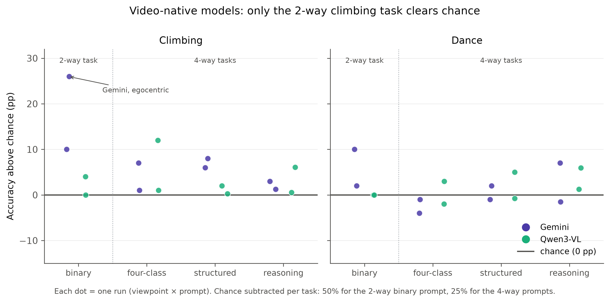
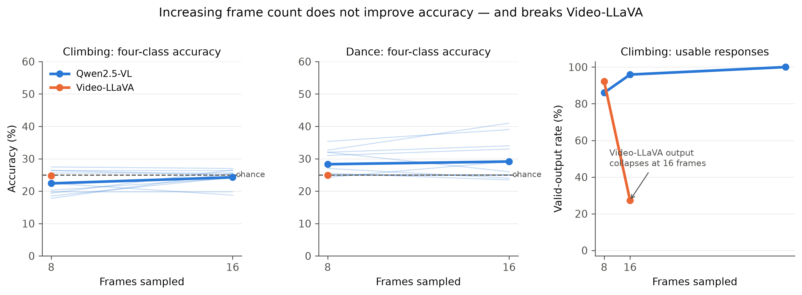
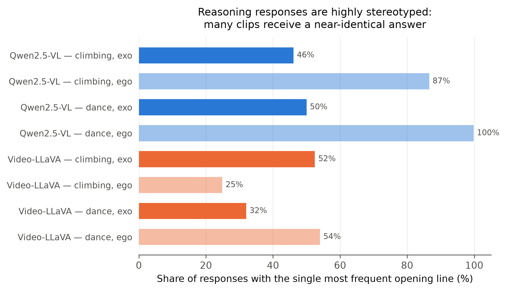

## Abstract

Judging how *well* a person performs a physical activity — not merely what they are doing — is a task humans perform effortlessly and one that underpins coaching, remote training, and surgical and sports education. Modern vision-language models (VLMs) are marketed as general-purpose video reasoners, which raises the question of whether they can perform proficiency estimation zero-shot, without task-specific supervision. This dissertation answers that question and, more importantly, localises the failure it uncovers.

Four VLMs were evaluated zero-shot across two deliberately distinct video-input paradigms: fixed-count frame extraction (Qwen2.5-VL-7B and Video-LLaVA-7B at 8, 16 and 32 frames) and duration-proportional ~1 fps sampling (Gemini 3.1 Flash-Lite via genuine native ingestion, and Qwen3-VL-8B via an OpenCV substitute adopted after the model's native pipeline failed with an fps-fallback out-of-memory bug). Each model was tested under four prompt formats — binary, four-class, structured and free-text reasoning — across egocentric and exocentric viewpoints, entire and task-trimmed clips, on a primarily Ego-Exo4D-derived benchmark of bouldering and dance, with cross-domain tests on basketball, JIGSAWS surgical suturing and a mixed-activity set.

No model produces a reliable above-chance result on four-class skill assessment. The dominant failure mode is **label collapse**: in roughly 45% of all conditions the model assigns a single label to 87–100% of clips irrespective of ground truth, which a class-balanced benchmark then silently converts into a chance-level accuracy score. A scene-content diagnostic confirms that the models perceive activity, colour and subject count correctly while the skill judgment stays constant, isolating the failure to skill assessment rather than to visual perception or video decoding.

Two controls locate the bottleneck precisely. A linear classifier over frozen CLIP features reaches 67.0% four-class accuracy (5-fold cross-validation, 95% CI [62.5%, 71.5%]) on the very clips where the VLMs score 24–25%; a text-only control that supplies real expert commentary and no video at all collapses at 26%. Vision alone succeeds; vision-to-language fails; language-to-language fails. The bottleneck therefore lies at the language-generation step, not at visual grounding. Since supervised methods report 47–53% top-1 on the same benchmark, this is a zero-shot transfer failure rather than a task ceiling. A secondary methodological contribution follows directly: bare accuracy is uninterpretable for zero-shot VLM classification, and every accuracy figure must be reported alongside per-class recall and the predicted-label distribution.

**Keywords:** vision-language models, zero-shot evaluation, skill assessment, action quality assessment, label collapse, Ego-Exo4D.

---

\newpage

# 1. Introduction

## 1.1 Motivation

Computer vision has largely solved the question *what is this person doing?* Contemporary action-recognition systems classify hundreds of activity categories at superhuman consistency, and video-language models now describe scenes in fluent prose. A different and considerably harder question remains open: *how well is this person doing it?* Proficiency estimation — deciding whether a climber is a novice or an expert, whether a suturing technique is competent, whether a dancer has mastered a sequence — is the question that actually matters in the applications people care about. Coaching feedback, remote athletic training, physical rehabilitation, and surgical and clinical education all depend on assessing quality of execution rather than category of action.

Historically this problem has been approached with bespoke supervised systems. Action quality assessment (AQA) models are trained on domain-specific score labels, frequently with pose estimation or optical flow as an intermediate representation, and they do not transfer beyond the domain they were fitted to. Building such a system for a new activity requires a new annotated dataset, which is expensive precisely because the annotation must come from a domain expert rather than a crowd worker.

Vision-language models offer an obviously attractive alternative. A model that has been pre-trained on internet-scale image–text and video–text data has plausibly encountered a great deal of instructional content about climbing technique, dance form and surgical practice, and it can be queried in natural language without any task-specific training. If VLMs possessed even a coarse, transferable notion of "skilled versus unskilled human movement," zero-shot proficiency estimation would become immediately available across arbitrary domains. The premise of this dissertation is to test that possibility seriously, at scale, and — critically — to determine *where* it breaks if it breaks.

## 1.2 Research question

The dissertation is organised around a single two-part question:

> **Can vision-language models judge human skill level from video, zero-shot — and if they fail, is the failure perceptual or linguistic?**

The second clause is what distinguishes this work from a benchmark report. Establishing that a model scores at chance is straightforward; establishing *why* requires controls that separate the model's visual pathway from its language pathway. A failure at the perceptual stage — the model cannot see the fine-grained motion cues that distinguish an expert from a novice — has entirely different implications from a failure at the generation stage, where the visual evidence is present in the representation but the language head cannot convert it into the correct categorical token. The first would call for better visual encoders, higher frame rates and finer temporal resolution; the second would call for better alignment between the visual representation and the label vocabulary, and would predict that simply scaling visual input is futile. The experiments reported here support the second diagnosis.

## 1.3 Approach in brief

Four VLMs were evaluated zero-shot on a class-balanced proficiency benchmark derived principally from Ego-Exo4D. The evaluation was structured as an escalating investigation rather than a flat grid: a feasibility test, followed by ablations of the obvious confounds (frame budget, temporal trimming, camera viewpoint, prompt format, label granularity), followed by diagnostic controls designed to localise the failure, followed by cross-domain tests to establish whether the finding is a property of climbing or of the models.

A deliberate methodological axis runs through the model selection. Two models (Qwen2.5-VL-7B, Video-LLaVA-7B) receive a *fixed* number of uniformly spaced frames regardless of clip duration — the only paradigm in which "does more frames help?" is a well-posed question. Two models (Gemini 3.1 Flash-Lite, Qwen3-VL-8B) receive video at a *duration-proportional* ~1 fps rate, which is closer to how video-native systems are actually deployed. Pairing an open-weight model with the proprietary model inside the same sampling paradigm allows any Gemini advantage to be attributed either to the input paradigm or to the model itself — a distinction that turns out to matter.

## 1.4 Contributions

1. **A systematic zero-shot evaluation of proficiency estimation** across four VLMs, two video-input paradigms, four prompt formats, two viewpoints, three frame budgets, two trimming conditions and five activity domains — approximately 130 experimental conditions in total, all re-scored through a single shared answer parser so that numbers are comparable across models.

2. **Identification and quantification of label collapse as the dominant failure mode.** Roughly 45% of conditions assign a single label to 87–100% of clips regardless of ground truth. On a balanced benchmark this produces exactly chance-level accuracy, which is indistinguishable from honest uncertainty unless the predicted-label distribution is inspected.

3. **Localisation of the failure to the language-generation step**, via three complementary controls: a scene-content diagnostic showing that perception is intact, a frozen-CLIP linear probe reaching 67.0% four-class accuracy where the VLMs reach 24–25%, and a text-only commentary control that collapses at 26% despite receiving genuine expert descriptions of the performance.

4. **A reporting convention offered as a methodological contribution:** accuracy must never be reported without per-class recall and the predicted-label distribution. The JIGSAWS result in this dissertation — 65.5% accuracy produced by a model that answered "Novice" 29 times out of 29 — is the cautionary example that motivates the convention.

5. **A transparent account of engineering failure modes in current VLM tooling**, including a context-window overflow that silently truncates Video-LLaVA prompts, an fps-fallback out-of-memory bug in Qwen3-VL's native video pipeline, and run-to-run non-determinism in which two identical Qwen2.5-VL runs disagreed on 86 of 100 predictions.

## 1.5 Structure of the dissertation

Chapter 2 reviews skill assessment, the supervised AQA lineage, video-language model architectures and their documented limitations, and the datasets used. Chapter 3 sets out the task formulation, benchmark construction, models, prompts, ablation axes, parsing pipeline and evaluation protocol, including the three localisation controls. Chapter 4 presents the results and discussion, moving from the binary task through four-class classification and the collapse phenomenon to the localisation experiments, ablations, cross-domain tests, qualitative analysis of generated text, and reliability findings. Chapter 5 concludes.

\newpage

# 2. Background and Related Work

## 2.1 What "skill level" means and why it is hard to label

Skill is not a visual category in the way that "climbing" is. Two clips can contain identical actions, identical equipment and identical scene composition and differ only in the efficiency, economy and precision of the movement. The distinguishing evidence is distributed over time and over subtle kinematic detail: hesitation before a hold, over-gripping, an unnecessary weight shift, a leg that swings rather than steps.

Psychological accounts of expertise provide the conceptual scaffolding for the label scale used here. The Dreyfus model of skill acquisition [1] posits a staged progression from novice through advanced beginner and competent to proficient and expert, in which the qualitative character of performance — not merely its speed or accuracy — changes at each stage. Ericsson's deliberate-practice framework [2] similarly treats expertise as a continuum accumulated over long training horizons. Both accounts imply that a coarse binary novice/expert distinction discards the very structure that makes expertise interesting, and both motivate benchmarks with more than two levels. They also, however, predict that adjacent levels are genuinely difficult to distinguish — a prediction this dissertation's results confirm emphatically, since no model tested ever resolves the "Early Expert" class.

Ego-Exo4D [3] operationalises this scale through *proficiency demonstrator* annotations, in which domain experts assign each participant to one of four levels — Novice, Early Expert, Intermediate Expert, Late Expert — based on training history and demonstrated competence. This four-level scale is adopted throughout the present work.

## 2.2 Action quality assessment and skill determination

The supervised lineage of this problem is well established. Early AQA work regressed judges' scores in Olympic diving and gymnastics from spatiotemporal features, and later systems adopted deep architectures with multi-task objectives that predict action class and quality jointly [4]. Uncertainty-aware score distribution learning [5] recognised that quality labels are inherently noisy and modelled them as distributions rather than points. Fine-grained benchmarks such as FineDiving [6] pushed towards procedure-aware assessment, decomposing an action into sub-steps that are scored individually.

A parallel line addresses *skill determination* specifically — deciding which of two people is better at a task, rather than assigning an absolute score. Doughty et al. [7] framed this as pairwise deep ranking, learning from relative rather than absolute supervision, and later extended it with rank-aware temporal attention for long videos [8], on the observation that only a fraction of a long video is diagnostic of skill.

Two properties of this literature matter here. First, it is uniformly supervised and uniformly domain-specific: a model trained to rank surgical suturing does not transfer to bouldering. Second, and importantly for interpreting the present results, trained methods on the Ego-Exo4D proficiency benchmark report roughly 47–53% top-1 accuracy on the four-class task. The task is therefore *solvable*, at roughly twice chance, by a model that has been fitted to it. Any zero-shot failure reported in this dissertation is consequently a transfer failure, not evidence that the labels are noise.

## 2.3 Video-language models

Contemporary VLMs pair a pre-trained vision encoder with a large language model through a learned projection, following the visual-instruction-tuning recipe popularised by LLaVA [9]. Video extends this by encoding multiple frames and concatenating their visual tokens into the language model's context. Video-LLaVA [10] aligns image and video representations before projection and uses a Vicuna-7B [11] language backbone. The Qwen-VL family [12] adopts a native dynamic-resolution vision transformer with window attention and a multimodal rotary positional encoding designed to represent time explicitly, and Qwen3-VL extends this to longer video contexts. Proprietary systems such as the Gemini family [13] accept raw video files directly and perform their own internal sampling.

Two architectural facts drive several results in this dissertation.

**Frame budget is bounded by context budget.** Each frame is encoded as a fixed number of visual tokens — for Video-LLaVA's CLIP ViT-L/14 encoder, 256 tokens per frame. With a Vicuna-7B backbone limited to 4,096 tokens, 16 frames consume exactly 4,096 tokens before a single word of prompt text is added. Increasing the frame budget is therefore not a free parameter; past a model-specific threshold it destroys the prompt.

**Sampling paradigm is a genuine experimental variable.** Fixed-count extraction gives a 5-second clip and a 90-second clip the same number of frames, and thus radically different effective frame rates. Duration-proportional sampling holds the rate constant and lets the token count vary. These are different views of the same video, and conflating them under "frame count" obscures a real methodological axis. This dissertation treats it as a first-class variable.

## 2.4 Known limitations of vision-language models

A growing body of evidence suggests that VLM visual understanding is shallower than benchmark scores imply. Contrastively pre-trained vision-language models behave in important respects like bags of words, showing limited sensitivity to word order and relational composition [14], and image-text matching fails on minimally contrastive pairs designed to require compositional reasoning [15]. More directly relevant here, "Eyes Wide Shut" [16] demonstrates that multimodal LLMs fail on visual details that are trivially discriminable to CLIP features themselves, implying that the failure lies downstream of the encoder — in the projection and the language model — rather than in perception. Evaluations of temporal understanding in video LLMs similarly find that models frequently answer video questions correctly from a single frame, exploiting static appearance rather than motion.

The present work extends this diagnosis to a domain where the discriminative signal is *purely* dynamic and evaluative, and supplies a within-task version of the "Eyes Wide Shut" argument: the same clips that a linear probe over frozen CLIP features classifies at 67% are classified at chance by VLMs whose visual encoders are of the same family.

Separately, the label-collapse phenomenon documented here connects to work on calibration and prior bias in instruction-tuned language models, which are known to exhibit strong label priors under few-shot and zero-shot classification and to require calibration to recover usable performance. What has not previously been quantified, to the author's knowledge, is how systematically this prior dominates on a *visual* evaluative task, and how completely a class-balanced benchmark disguises it as chance-level competence.

## 2.5 Datasets

**Ego-Exo4D** [3] is a large multi-view dataset of skilled human activity captured simultaneously from an Aria headset (egocentric) and multiple static cameras (exocentric). It provides scenario labels (including Bouldering, Dance, Basketball, Music, Cooking and Soccer), expert proficiency-demonstrator annotations on the four-level scale, and per-take `task_start_sec` / `task_end_sec` annotations that mark the interval in which the activity actually occurs. The simultaneous ego/exo capture makes viewpoint a controllable variable rather than a confound, which is exploited throughout Chapter 4.

**JIGSAWS** [17] is a robotic surgical dataset of suturing, knot-tying and needle-passing performed by surgeons of documented experience levels, annotated with self-reported hours of robotic surgical experience that map to novice/intermediate/expert categories. It is used here as a genuinely out-of-distribution cross-domain test: a different capture setup, a different domain vocabulary, and a different skill construct.

## 2.6 Positioning

This dissertation sits at the intersection of three threads: the supervised AQA literature, which establishes that the task is learnable; the VLM-limitations literature, which establishes that benchmark competence can be superficial; and the practical question of whether zero-shot deployment is viable. The specific gap it addresses is that existing zero-shot VLM evaluations report aggregate accuracy without inspecting output distributions, and consequently cannot distinguish a model that is uncertain from a model that is degenerate. The controls introduced in Chapter 3 — particularly the CLIP probe and the text-only commentary control — are designed to close that gap.

\newpage

# 3. Methodology

## 3.1 Task formulation

Given a video clip of a person performing an activity, the model must assign a proficiency label. Two label scales are used.

**Binary.** Novice versus Expert, on a balanced set of 50 clips (25 per class); chance accuracy 50%. Late Expert ground-truth clips are scored as "Expert" by convention.

**Four-class.** Novice, Early Expert, Intermediate Expert, Late Expert, on a balanced set of 100 clips (25 per class); chance accuracy 25%.

The two scales are never compared directly. A binary accuracy of 50% and a four-class accuracy of 25% carry exactly the same information content — none — and reporting them on a shared axis is the single easiest way to mislead a reader. All tables in Chapter 4 keep them physically separate, and the headline figures plot accuracy *relative to each task's own chance baseline* so that both share a single zero line.

A three-class ablation (Novice / Intermediate / Expert, chance 33.3%) is reported separately in §4.6.4.

## 3.2 Benchmark construction

The primary benchmark is drawn from Ego-Exo4D bouldering takes, using the proficiency-demonstrator annotations as ground truth and sampling 25 clips per skill level. Dance serves as a contrasting second domain with an identical construction, chosen because its skill signal is expressive and whole-body rather than goal-directed and object-mediated, which makes it a useful stress test of any conclusion drawn from climbing.

Three cross-domain sets were built. **Basketball** uses the corresponding Ego-Exo4D scenario with the same schema. A **mixed-activity** set of 100 clips combines Basketball, Music (piano), Cooking and Soccer, balanced at 25 clips per skill class with activities deliberately mixed *within* each class, and explicitly excluding climbing and dance so that it tests transfer to activities never seen in the main experiments. **JIGSAWS** was filtered to Novice and Expert only, yielding 29 usable clips.

Two properties of the benchmarks must be stated up front because they shape the interpretation of results.

First, **the JIGSAWS set is not class-balanced** (19 Novice, 10 Expert). This was unavoidable given the available annotations after filtering, and it means raw accuracy on JIGSAWS is misleading by construction — a fact that turns out to be instructive rather than merely inconvenient (§4.7.2).

Second, **a video-availability audit found systematic missing source files.** Nine of ten `uniandes_bouldering_*` takes referenced by the climbing benchmark JSONs have no video on disk for either the exocentric cam01 or the egocentric Aria stream. This produces a systemic error floor of roughly 9% in every locally executed climbing run. Sixteen of fifty original basketball clips were similarly absent, and that benchmark was rebuilt from the annotation pool. One further climbing clip (`uniandes_bouldering_027_87`) has valid video yet still fails, an unexplained residual pipeline bug. Crucially, **Gemini was unaffected** because it reads uploaded video rather than the local mirror, which confounds direct model comparison on the affected clips. This is reported as a limitation rather than concealed; the affected rows are excluded from accuracy denominators and their rate is reported explicitly (§4.9).

## 3.3 Models and the two video-input paradigms

Four models were evaluated, grouped by how video reaches them (Table 3.1).

**Table 3.1 — Models and video-input paradigms.**

| Model | Backbone / access | Paradigm | Frames per clip | Notes |
|---|---|---|---|---|
| Qwen2.5-VL-7B | Open weights, local GPU | Fixed count | 8, 16, 32 (and a 64-frame probe, both activities) | Uniform OpenCV extraction, independent of duration |
| Video-LLaVA-7B | Open weights (Vicuna-7B-v1.5, CLIP ViT-L/14), local GPU | Fixed count | 8, 16, (32 attempted) | 256 visual tokens/frame against a 4,096-token context |
| Gemini 3.1 Flash-Lite | Proprietary API | Native video | ~1 fps (internal) | Raw video file uploaded; no manual extraction |
| Qwen3-VL-8B | Open weights, local GPU | ~1 fps proportional | 4–263 (median 26 climbing, 64 dance) | OpenCV substitute after native-pipeline failure |

**Group 1 — fixed-count extraction.** A manual OpenCV pass extracts exactly *n* uniformly spaced frames irrespective of clip duration. This is the only paradigm in which frame count is decoupled from clip length and therefore the only one in which the frame-budget ablation is meaningful.

**Group 2 — duration-proportional sampling.** Gemini receives the raw video file through the API's file-upload mechanism and performs its own internal sampling at approximately one frame per second. Qwen3-VL-8B was *intended* to be its open-weight counterpart in the same paradigm: the original script passed the video directly to the model's native video processor with `nframes = round(duration_sec)`, explicitly configured to match Gemini's ~1 fps rate so that any Gemini advantage could be attributed to either the paradigm or the model.

**This native path failed.** The video processor ignored the requested `nframes` and silently fell back to sampling at 24 fps, exhausting GPU memory. Only 12 of 50 climbing clips completed before the run was abandoned; three of four prompt files are empty. All Qwen3-VL numbers reported in this dissertation therefore come from a manual OpenCV substitute built to reproduce the same ~1 fps target rate (`n = max(1, round(duration_sec))`, 448 px resize) while bypassing the buggy pipeline. The consequence must be stated precisely: **Gemini and Qwen3-VL are comparable in sampling *rate*, not in ingestion *mechanism***, and no fixed-frame-count comparison exists for either of them. There is no native-pipeline attempt for dance at all.

## 3.4 Prompt formats

Four prompt formats were used, spanning the space from maximally constrained output to maximally free.

1. **Binary** — a single-token answer to "Is this person a Novice or an Expert?"
2. **Four-class** — a single-label answer constrained to the four proficiency levels.
3. **Structured** — a fixed template requiring `Observations:` / `Errors:` / `Skill Level:` fields, parsed post hoc from the final field.
4. **Reasoning** — free-text chain-of-thought analysis terminating in a skill judgment, parsed post hoc.

The formats were chosen to test a specific hypothesis: that constrained output formats give the model nothing to condition on beyond its prior, whereas requiring intermediate observations might force the judgment to be grounded in stated visual evidence. Prompt wording was held constant across models within a format, and adapted only in domain vocabulary for JIGSAWS (surgeon/suturing rather than climber/route).

## 3.5 Ablation axes

- **Frame count** — 8, 16 and 32 frames for Qwen2.5-VL, with an additional 64-frame probe on both climbing and dance; 8 and 16 for Video-LLaVA; not applicable to Group 2 by construction.
- **Temporal trimming** — the entire clip versus the clip trimmed to the annotated `task_start_sec`–`task_end_sec` window. This ablation was motivated by a diagnostic finding (§3.8.3) that setup and idle footage is read as evidence of novicehood.
- **Viewpoint** — exocentric (cam01 unless stated) versus egocentric (Aria headset); Gemini additionally has a combined/single-view condition.
- **Camera placement within exocentric** — cam01 versus cam03, and a per-clip *best exocentric camera* probe using each take's annotated best camera (cam03 ×23, cam02 ×21, cam01 ×5, cam04 ×1), to separate "which camera" from "ego versus exo".
- **Label granularity** — the four-class scale versus a three-class collapse (§4.6.4).

## 3.6 Answer parsing and the re-scoring pipeline

Free-text and templated outputs must be mapped to labels, and the original harness did this with a naive fixed-priority substring scan. Audit revealed two systematic failure modes. It misread **negated and aspirational statements** — "not yet a Late Expert" was scored as *Late Expert* — and it resolved **hedged disjunctions** arbitrarily by returning whichever label it happened to check first.

The second failure is not merely a parsing artefact but a genuine model behaviour worth reporting in its own right. Under free-text reasoning prompts, Qwen2.5-VL frequently emits the literal disjunction "novice or early expert" rather than committing to a label: 24 occurrences in one 16-frame trimmed climbing run, 12 in the corresponding entire-clip run, 11 and 7 in the 8-frame variants, against effectively zero under structured or four-class prompts. Any "correct" Early Expert credit scored from such a disjunction is indistinguishable from a coin flip.

A negation- and aspiration-aware re-parser was therefore written and applied to **every raw answer in the project**, treating unresolved disjunctions as `Unknown` rather than guessing. Its impact was material: 175 of 7,812 stored labels changed in the fixed-frame set, with per-run accuracy shifting by up to 8 percentage points, and 171 of 2,765 in the video-native set with shifts under 3 points. The practical consequence is that **the stored `*_predicted` and `*_correct` columns in the raw result CSVs are unreliable**, and every number in Chapter 4 is taken from the re-scoring pipelines. Both pipelines import the same parser, so numbers are directly comparable across the two paradigms.

## 3.7 Evaluation protocol

Four conventions govern all reporting.

1. **Two chance baselines, never mixed.** 50% for binary (n = 50), 25% for four-class (n = 100), 33.3% for the three-class ablation (n = 30).

2. **Accuracy is always paired with per-class recall and the predicted-label distribution.** This is the central methodological safeguard of the dissertation and was developed *during* the project in response to the diagnostic finding of §3.8.3. Without it, a degenerate model and an honestly uncertain model are indistinguishable.

3. **Collapse is defined operationally.** A run is designated *collapsed* if at most one ground-truth class receives non-zero accuracy — equivalently, if the model effectively always emits one label. Collapsed runs are reported in full, because they are findings about model behaviour, but are never cited as evidence of discriminative skill judgment.

4. **Significance testing.** A binomial test against 50% for binary tasks; a chi-squared goodness-of-fit test against uniform for four-class tasks. A caveat must accompany the latter: chi-squared significance here largely reflects the *lopsidedness of the model's output distribution*, not accuracy above chance. A 100%-Novice collapse at 25% accuracy is "significant" at p < 10⁻⁴⁰ precisely because it is degenerate. Four-class p-values are therefore interpretable only alongside the collapse check.

Runs with fewer than 20 valid answers are excluded from accuracy figures, though they remain in the summary tables and in the output-validity analysis.

## 3.8 Localisation controls

Three controls were designed to determine whether an observed failure is perceptual or linguistic. They constitute the methodological core of the dissertation.

### 3.8.1 Frozen-CLIP linear probe

If the visual representation contains skill-relevant information, a *linear* classifier over frozen features should recover it, and any VLM failure on the same clips cannot be attributed to the encoder. Eight frames per clip were encoded with a frozen CLIP ViT-L/14 image encoder and mean-pooled into a single embedding. A multinomial logistic regression was fitted over the four classes with 5-fold stratified cross-validation on the same 100 exocentric climbing clips used in the main four-class evaluation, so that every clip is evaluated exactly once by a model trained on the remainder. No language model and no prompt are involved at any point. Most-frequent-class and stratified-random baselines were computed for comparison.

### 3.8.2 Text-only commentary control

If the failure were purely one of visual grounding, then removing vision and supplying the description directly should repair it. Expert coaching commentary accompanying each climbing clip was supplied as text, with no video and no frames at all, and the model was asked for the four-class skill level over the same 100 clips (25 per class). This control is the mirror image of the CLIP probe: the probe removes language, the commentary control removes vision.

### 3.8.3 Scene-content diagnostic

A per-frame qualitative probe was run on clips of known proficiency, asking the model to report `person_visible`, `person_action` and `skill_from_observations` for individual frames. This established two things. First, that scene content is perceived correctly and varies appropriately across clips — activity, colour and subject count all track the video. Second, that early frames showing setup, standing or looking at a route marker are scored "Novice" while only frames of active climbing are scored higher. The first observation isolates the failure to skill assessment rather than to perception or video decoding; the second directly motivated the trimming ablation of §3.5.

## 3.9 Experimental grid and coverage

Approximately 130 conditions were executed. Not every cell of the nominal grid is filled, and the gaps are themselves informative (Table 3.2).

**Table 3.2 — Experimental coverage and known gaps.**

| Axis | Coverage | Gaps and reasons |
|---|---|---|
| Models × prompts | All 4 models × 4 prompts, climbing and dance | Video-LLaVA 16-frame structured/reasoning aborted (context overflow) |
| Frame count | 8/16/32 (+64 probe) for Qwen2.5-VL; 8/16 for Video-LLaVA | Not applicable to Group 2 — neither Gemini nor Qwen3-VL was ever run at a fixed count |
| Trimming | entire + trimmed for both Group 1 models | No Gemini trimmed runs |
| Viewpoint | ego + exo for all models | Gemini uses a combined/single view in place of exo in some files |
| Camera within exo | cam01, cam03, per-clip best-exo | Climbing only |
| Cross-domain | Basketball, JIGSAWS, mixed-activity | JIGSAWS unbalanced; basketball rebuilt after missing files |
| Native ingestion | Gemini only | Qwen3-VL native abandoned at 12/50 clips; no native dance attempt |

Open-weight models were run locally on GPU; Gemini was accessed through its API. This asymmetry is the source of the missing-video confound noted in §3.2 and is flagged wherever cross-model comparisons are drawn.

\newpage

# 4. Results and Discussion

This chapter presents the empirical findings. It follows the structure of the investigation: the binary feasibility test (§4.2), four-class classification (§4.3), the collapse phenomenon that dominates both (§4.4), the controls that localise the failure (§4.5), the ablations that rule out trivial explanations (§4.6), cross-domain generalisation (§4.7), qualitative analysis of what the models actually write (§4.8), and reliability findings (§4.9), closing with a synthesis (§4.10).

## 4.1 Reporting conventions

The conventions of §3.7 apply throughout and are restated in compressed form because they govern how every number below should be read. Binary results (n = 50, chance 50%) are kept in separate tables from four-class results (n = 100, chance 25%). Every accuracy is paired with per-class recall and the predicted-label distribution. A run is *collapsed* if at most one ground-truth class has non-zero accuracy; collapsed runs are reported but never cited as discriminative evidence. All numbers come from the re-scoring pipelines, not from stored CSV columns.

Figure 4.1 and Figure 4.2 make the aggregate case before any individual number is discussed. Both plot every run's accuracy *minus its own chance baseline*, so the two task types share one zero line and the n = 50 versus n = 100 comparability problem disappears.

{width=6.2in}

{width=6.2in}

## 4.2 Binary skill discrimination

The binary task is the feasibility floor: if a model cannot separate a novice from an expert when given only two options, nothing finer is worth attempting.

**Table 4.1 — Binary results, climbing (Novice vs. Expert, balanced n = 50, chance = 50%).**

| Model | Input | Trim | View | Accuracy | Novice recall | Expert recall | Predicted labels | Verdict |
|---|---|---|---|---|---|---|---|---|
| Gemini | native | entire | ego | **76.0%** | 84% | 68% | Nov 29, Exp 21 | **Genuine signal** (binomial p = 0.0003) |
| Gemini | native | entire | exo | 60.0% | 52% | 68% | Exp 29, Nov 21 | Not significant (p ≈ 0.26), non-collapsed |
| Video-LLaVA | 16 fr | entire | exo | 76.0% | 88% | 64% | mixed | Isolated artefact — see §4.9 |
| Video-LLaVA | 16 fr | entire | ego | 32.0% | 48% | 16% | mixed | Below chance, same clips |
| Video-LLaVA | 8 fr | trimmed | exo | 60.0% | 100% | 20% | Nov 45, Exp 5 | Weak, near-collapse |
| Qwen3-VL | ~1 fps | entire | exo | 54.0% | 100% | 8% | Nov 48, Exp 2 | Near-collapse |
| Qwen3-VL | ~1 fps | entire | ego | 50.0% | 100% | 0% | Nov 50 | Collapse |
| Qwen2.5-VL | 8/16/32/64 fr | all | all | 50.0% | 100% | 0% | Nov 50 | **Total collapse** (p = 1.0) |
| Video-LLaVA | 32 fr | entire | both | — | — | — | 48/50 ERROR | Run failed outright (§4.9) |

**Table 4.2 — Binary results, dance (balanced n = 50, chance = 50%).**

| Model | Input | View | Accuracy | Novice recall | Expert recall | Predicted labels | Verdict |
|---|---|---|---|---|---|---|---|
| Gemini | native | exo | 60.0% | 52% | 68% | Exp 29, Nov 21 | Not significant (p = 0.20), non-collapsed |
| Gemini | native | ego | 52.0% | 100% | 4% | Nov 49, Exp 1 | Near-collapse |
| Qwen3-VL | ~1 fps | exo | 50.0% | 92% | 8% | Nov 46, Exp 4 | Near-collapse |
| Qwen3-VL | ~1 fps | ego | 50.0% | 100% | 0% | Nov 50 | Collapse |
| Qwen2.5-VL | all 8 conditions | both | 50.0% | 100% | 0% | Nov 50 | Collapse in every run |
| Video-LLaVA | all 8 conditions | both | 50.0% | 100% | 0% | Nov 50 | Collapse in every run |

Because the test set is class-balanced, accuracy is the arithmetic midpoint of the two recalls, and **every degenerate one-label strategy lands on exactly 50%**. This geometric fact is the reason the binary results cannot be read from accuracy alone, and Figure 4.3 makes it visible: all degenerate strategies lie on the diagonal, and only Gemini's climbing-ego run, at (84, 68), sits meaningfully off it.

{width=4.6in}

Three findings follow.

**Gemini's egocentric climbing result is the only unambiguous above-chance result in the entire project.** At 76.0% with balanced recalls of 84% and 68%, it is large in margin, statistically significant, and confirmed independently by both re-scoring pipelines. It demonstrates that the coarsest proficiency distinction is within reach of the strongest model tested.

**Qwen2.5-VL's binary behaviour deserves its own statement.** It answered "Novice" for 100% of clips in *every* binary condition tested — 8, 16, 32 and 64 frames; entire and trimmed; egocentric and exocentric; climbing and dance; cam01, cam03 and per-clip best exocentric camera; and every cross-domain set. Its 50% is base rate, not judgment. That a fixed answer survives an eightfold increase in frame budget and a change of activity domain is the single most consistent negative result in this work.

**Video-LLaVA's 76% is not comparable to Gemini's.** The same clips scored 32% — below chance — on the egocentric view, and, as §4.9 establishes, the 16-frame binary prompt exceeded the model's context window by roughly 67 tokens and was silently truncated. A number produced under silent truncation cannot be attributed to intact 16-frame evaluation, and it is reported here only with that caveat attached.

## 4.3 Four-class skill classification

At four levels, the picture is uniform: **no model produces a reliable above-chance result.** Re-scored pooled accuracies are Gemini 29% (climbing) / 25% (dance) and Qwen3-VL 29% / 27%, with Qwen2.5-VL and Video-LLaVA at or below those figures — all within a few points of the 25% baseline.

**Table 4.3 — Climbing, representative four-class results (n = 100, chance = 25%).**

| Model | Prompt | Input | View | Acc | Per-class recall (N / E / I / L) | Note |
|---|---|---|---|---|---|---|
| Qwen3-VL | fourclass | ~1 fps | ego | **37%** | 92 / 0 / 56 / 0 | Best four-class climbing result of any model |
| Gemini | structured | native | exo | 33% | 40 / 0 / 92 / 0 | Gemini's best climbing result |
| Gemini | fourclass | native | ego | 32% | 48 / 0 / 80 / 0 | |
| Video-LLaVA | structured | 8 fr | ego (trimmed) | 30% | 60 / 4 / 12 / 44 | Only run with substantial Late Expert recall |
| Qwen2.5-VL | fourclass | 16 fr | exo | 27% | 92 / 0 / 16 / 0 | |
| Qwen3-VL | structured | ~1 fps | exo | 27% | 24 / 0 / 64 / 20 | First climbing run to populate Late Expert |
| Qwen2.5-VL | reasoning (re-parsed) | 16 fr | exo | 20% | 28 / 16 / 28 / 8 | **Only climbing run resolving all four classes** |

**Table 4.4 — Dance, representative four-class results (n = 100, chance = 25%).**

| Model | Prompt | Input | View | Acc | Per-class recall (N / E / I / L) | Note |
|---|---|---|---|---|---|---|
| Qwen2.5-VL | structured | 16 fr | exo | **41%** | 88 / 0 / 76 / 0 | Best Qwen2.5-VL result in the project |
| Qwen2.5-VL | structured | 16 fr | exo (trimmed) | 39% | 68 / 0 / 88 / 0 | Close second |
| Qwen2.5-VL | fourclass | 16 fr | exo (trimmed) | 34% | 64 / 0 / 72 / 0 | |
| Gemini | reasoning | native | exo | 32% | 28 / 4 / 96 / 0 | Gemini's best dance result |
| Video-LLaVA | reasoning | 8 fr | ego (trimmed) | 31% | 0 / 16 / 12 / 96 | Late-Expert-dominated (§4.4) |
| Qwen3-VL | structured | ~1 fps | exo | 30% | 12 / 4 / 80 / 24 | Best Qwen3-VL dance result |

Reading the per-class columns rather than the accuracy column changes the interpretation entirely.

**"Early Expert" is never resolved by any model.** Its recall is zero in essentially every run in both tables. The single exception is the re-parsed Qwen2.5-VL reasoning run at 16%, which is also the only climbing run in the project to give all four classes non-zero accuracy — and it scores 20%, below chance. **"Late Expert" is scarcely better**, populated only by Video-LLaVA's structured runs and Qwen3-VL's structured runs. In other words, **a four-level scale is being answered as a two-level one.** Gemini on climbing never once predicts Early or Late Expert in any four-class, structured or reasoning run; it silently reduces the scale to a Novice-versus-Intermediate choice.

The apparent headline results dissolve under the same reading. Qwen2.5-VL's 41% on dance — the best result this model achieves anywhere — has recalls of 88 / 0 / 76 / 0. It is not four-class discrimination; it is a two-label output whose Novice bias happens to align with the structured template's `Skill Level: Novice` field, on a benchmark where two of the four classes are being ignored. Qwen3-VL's 37% has the same shape (92 / 0 / 56 / 0).

Figure 4.4 shows why. The row-normalised confusion matrices are nearly uniform down the rows: the predicted distribution barely changes as the true skill level changes, which is to say that the predictions are close to statistically independent of the ground truth. Gemini labels 86–89% of Intermediate and Late Expert climbers "Intermediate Expert" — but also 67% of true novices.

{width=4.7in}

## 4.4 The label-collapse phenomenon

The results above are not a collection of near-misses. They are a single failure mode expressed in different vocabularies, and it is worth stating as a finding in its own right rather than as a caveat.

**Across roughly 45% of all conditions run, the model assigns a single label to 87–100% of clips regardless of ground truth.** On a class-balanced benchmark this converts directly into chance-level accuracy, which is precisely why it is invisible to accuracy-only reporting. Re-scored prediction shares make the scale concrete: on the binary task Qwen2.5-VL answers "Novice" for 100% of clips in both activities, and Video-LLaVA for 89.5% (climbing) and 100% (dance). Pooled over four-class prompts, Qwen2.5-VL's climbing predictions are 80% Novice, 18% Intermediate Expert and approximately 0% Early and Late Expert combined.

{width=6.2in}

{width=6.2in}

Three properties of the collapse are worth emphasising.

**The collapse target moves between model generations rather than disappearing.** The fixed-frame models default to "Novice" — 71% of all Qwen2.5-VL four-class predictions, 51% of Video-LLaVA's. The duration-proportional models default to "Intermediate Expert" — 79% of Gemini's climbing predictions, 62% of its dance predictions, roughly 47% for Qwen3-VL. Newer, stronger models are not less biased here; they are *differently* biased. This matters for the field's default assumption that scale resolves such issues: the failure was not attenuated by a generation of progress, only relocated.

**The prior can flip within a single model according to prompt format.** Video-LLaVA on dance defaults to "Novice" under binary and four-class prompts but to "Late Expert" under free-text reasoning, predicting it for 94–95 of 100 clips. The most plausible reading is that when permitted to free-associate, the model links flowing continuous dance motion to expertise — an association about the *concept* of dance rather than a judgment about the person in the video.

**Collapse is what makes accuracy uninterpretable.** This is the methodological moral, and §4.7.2 provides its clearest illustration: a model that answered "Novice" 29 times out of 29 scored 65.5% and would have been reported as the project's second-best result had only accuracy been inspected.

## 4.5 Locating the failure: perception or language?

Everything above establishes *that* zero-shot proficiency estimation fails. This section establishes *where*, and constitutes the dissertation's most precise claim. Three controls are used, and they point unanimously in the same direction.

### 4.5.1 Perception is intact

The scene-content diagnostic (§3.8.3) shows that the models describe scene content correctly and that their descriptions vary appropriately across clips: activity, dominant colour and number of subjects all track the video content. In the same responses, the skill judgment remains constant. A model that changes its description of the scene while holding its skill verdict fixed is not failing to see the video, and is not failing to decode it. The failure is specific to skill assessment.

### 4.5.2 Vision alone succeeds: the frozen-CLIP probe

A multinomial logistic regression over frozen, mean-pooled CLIP ViT-L/14 features achieves **67.0% four-class accuracy** on the same 100 exocentric climbing clips where the VLMs score 24–25% (Table 4.5).

**Table 4.5 — Frozen-CLIP linear probe, four-class climbing (n = 100, 8 frames per clip, 5-fold stratified CV).**

| Measure | Value |
|---|---|
| Per-fold accuracy | 0.65, 0.60, 0.70, 0.65, 0.75 |
| Mean cross-validated accuracy | **0.670** |
| Standard deviation across folds | 0.051 |
| Approximate 95% confidence interval | [0.625, 0.715] |
| Most-frequent-class baseline | 0.250 |
| Stratified-random baseline | 0.270 |
| Uniform random chance | 0.250 |
| Best VLM four-class result, same clips | 0.240–0.250 |

The result is decisive for the diagnosis. The classifier is *linear*, the features are *frozen*, no language model is involved, and no prompt is used at any point. The skill-relevant signal is therefore not merely present in general-purpose visual features — it is **linearly separable** in them, at more than twice chance and comfortably above the 47–53% reported by trained, task-specific methods on this benchmark. Whatever the VLMs are failing to do, extracting the visual evidence is not it. It is also worth noting that the probe uses a CLIP ViT-L/14 encoder of the same family as Video-LLaVA's own visual tower, which makes the contrast within-architecture rather than across it.

### 4.5.3 Language-to-language also fails: the text-only control

If the bottleneck were visual grounding, then removing vision and handing the model an expert's written description of the performance should repair the failure. It does not. Given only real expert coaching commentary and no video whatsoever, Qwen2.5-VL scores **26.0%** on the same four-class task (per-class recall 1/25 Novice, 7/25 Early, 18/25 Intermediate, 0/25 Late; predicted distribution: Intermediate 67, Early 30, Novice 3). Video-LLaVA scores 29.0% with the familiar collapse shape. Both sit at chance, with the same degenerate output distribution seen throughout the video experiments.

### 4.5.4 The argument

The three controls compose into a single chain:

- **Vision alone succeeds** — a linear probe over frozen visual features reaches 67%.
- **Perception within the VLM is intact** — scene descriptions vary correctly with content.
- **Vision-to-language fails** — the same models, on the same clips, score 24–25%.
- **Language-to-language fails** — given expert prose describing the performance, the models still score 26%.

The failure cannot be located in the visual encoder, since a linear map over its output solves the task. It cannot be located in video decoding or frame sampling, since scene content is reported correctly and since frame budget has no effect (§4.6.1). And it cannot be located in visual grounding *specifically*, since removing vision entirely and supplying the description in language does not help. What remains is the step that converts an internal representation — visual or textual — into a categorical proficiency judgment in language. **The bottleneck is at the language-generation step.**

This is a sharper claim than "VLMs are bad at skill assessment," and it has a concrete corollary: interventions that improve visual input are predicted to be futile, which is exactly what §4.6 finds across frame count, trimming, camera placement and viewpoint. It also predicts that the productive interventions lie elsewhere — in calibration against the label prior, in supervised alignment of the visual representation to the proficiency vocabulary, or in bypassing generation altogether, as the probe does.

## 4.6 Ablations

Every ablation in this section was run to rule out a trivial explanation for the collapse. None of them rescues performance, and that uniformity is itself evidence for the §4.5 diagnosis.

### 4.6.1 Frame count

{width=6.2in}

For Qwen2.5-VL, moving from 8 to 16 frames leaves four-class accuracy essentially unchanged, and binary accuracy is *identical* — the same 100% Novice collapse — at 8, 16 and 32 frames. A dedicated 64-frame climbing probe, eight times the standard budget, leaves binary collapse and four-class accuracy flat (20–26%). The single exception across the whole project is reasoning-exocentric, which rises from 18% at both 8 and 16 frames to 32% at 64. Inspection of the distribution shows this is not resolution of skill but *relocation of the default*: at 64 frames the model predicts Novice 0 times out of 25 for that condition, having shifted its collapse target to the Early/Intermediate region, where it happens to align better with the ground-truth distribution.

The same 64-frame probe was also run on dance, and the climbing effect does not generalize: every dance prompt/view either stays flat or drops below its 8/16-frame value at 64 frames (reasoning-exocentric 32%→26%→20%; structured-exocentric 32%→**41%**→27%, where 16 frames — not 64 — is dance's best result of any kind). Binary and egocentric fourclass/reasoning collapse to 100% Novice regardless of frame count, as on climbing. The one genuinely interesting frame-count effect in the project (climbing reasoning-exocentric) is therefore activity-specific, not a general property of giving the model more frames.

For Video-LLaVA, more frames actively destroy the model, for the architectural reason set out in §2.3 and quantified in §4.9. For Qwen3-VL, which chooses its own budget between 4 and 263 frames per clip, accuracy is flat across frame-count quartiles from roughly 10 to 165 frames; the only monotone effect is a rise in unusable, truncated answers.

**Frame budget is not the bottleneck.** No model extracts more skill signal from more frames.

### 4.6.2 Temporal trimming

The trimming ablation was the most theoretically motivated of the set: the diagnostic probe had shown that setup and idle footage is read as evidence of novicehood, so removing it should have helped. **It does not.** Qwen2.5-VL and Video-LLaVA binary runs remain 100%-Novice collapsed after trimming in every condition. Qwen2.5-VL dance structured moves from 41% (entire) to 39% (trimmed) at 16 frames and from 32% to 35% at 8 frames — noise-level shifts in opposite directions. Video-LLaVA climbing structured egocentric shows the largest positive shift, 23% to 30%, still at chance. Climbing reasoning moves the other way, from 14–15% to 10–12%.

The conclusion is stronger than "trimming does not help": **the Novice default survives removal of the footage that was hypothesised to cause it.** The prior is not an artefact of idle frames.

### 4.6.3 Viewpoint and camera placement

{width=6.2in}

No viewpoint is uniformly better, and the direction of the effect depends on both model and activity. **Gemini** is helped by egocentric video on climbing (60% → 76% binary) and hurt by it on dance (60% → 52%). **Qwen2.5-VL** shows a different pattern: egocentric input strengthens its Novice default rather than changing its accuracy, with the Novice share of predictions rising from 75% to 85% on climbing and from 36% to 90% on dance. This is why every surviving Qwen2.5-VL result is exocentric — the exocentric view is not more accurate so much as less collapsed. Its dance structured-exocentric run at 41% has a fully collapsed egocentric counterpart at exactly 25%. **Qwen3-VL** is insensitive to viewpoint.

Camera placement *within* the exocentric category has no effect at all. Switching from cam01 to cam03 leaves Qwen2.5-VL's binary collapse identical, and Video-LLaVA's cam03 reasoning (14–19%) is statistically indistinguishable from its cam01 counterpart. A per-clip *best exocentric camera* probe, selecting each take's annotated best camera, reproduces the same 100% Novice binary collapse and a reasoning accuracy of 24%, within the band of the fixed-camera runs. **The failure is not about where the camera is.**

### 4.6.4 Label granularity

If the four-level scale were simply too fine — Early and Intermediate Expert being genuinely hard to separate — then coarsening it should help. A three-class ablation (Novice / Intermediate / Expert, chance 33.3%, n = 30) tested this. The egocentric view reaches 26.7% with recalls of 0% Novice, 40% Intermediate and 40% Expert; the exocentric view reaches 30.0% but with 22 of 30 predictions being "Expert" — a collapse. Neither view resolves Novice at all.

**Coarsening the scale does not help; the collapse simply relocates to a different label.** This is consistent with the §4.5 diagnosis and inconsistent with the "scale too fine" hypothesis: a model that genuinely perceived a proficiency continuum but could not partition it finely would improve when the partition was coarsened.

## 4.7 Cross-domain generalisation

**Table 4.6 — Cross-domain and cross-dataset results.**

| Test | Model | Format | Accuracy | Verdict |
|---|---|---|---|---|
| Basketball (Ego-Exo4D) | Qwen2.5-VL | binary | 24.0% | Below chance; Novice 48%, Expert 0%; 15/16 error rows fall on Expert clips (missing videos) |
| JIGSAWS suturing | Qwen2.5-VL | binary | 65.5% | **Not signal** — "Novice" predicted 29/29; artefact of a 19 N / 10 E imbalance |
| Mixed activity | Qwen2.5-VL | binary | 25.0% (both views) | 100% Novice collapse |
| Mixed activity | Qwen2.5-VL | structured, exo | 19.0% | Kept; signal concentrated in Basketball and Cooking |
| Mixed activity | Qwen2.5-VL | structured, ego | 23.0% | Kept; same activity skew |
| Three-class ablation | Qwen2.5-VL | structured | 26.7% ego / 30.0% exo | Coarsening does not help (§4.6.4) |

### 4.7.1 The failure is domain-independent

The collapse holds across climbing, dance, basketball, surgical suturing and a mixed music/cooking/soccer set. This rules out the most parsimonious alternative explanation — that bouldering is unusually hard to assess, or that the Ego-Exo4D climbing annotations are unusually noisy. Whatever is failing is a property of the models, not of the domain.

### 4.7.2 JIGSAWS: the cautionary example

Qwen2.5-VL scores **65.5%** on JIGSAWS surgical suturing — nominally the second-highest number anywhere in this dissertation, and the only cross-domain result that looks like success. It is not. The model predicted "Novice" for all 29 clips, and 19 of the 29 ground-truth labels happen to be Novice; 19/29 = 65.5%. The number is a pure majority-class artefact of an imbalanced test set combined with a fully collapsed model.

This result is the empirical justification for the reporting convention adopted throughout this work. Under accuracy-only reporting it would have been presented as evidence of cross-domain transfer to surgical skill assessment. Under the paired accuracy-plus-distribution convention it is immediately and unambiguously identifiable as degenerate. The convention is cheap, and this is what it buys.

### 4.7.3 An activity-type pattern, offered as a hypothesis

The mixed-activity structured runs are the one place where the residual signal is not uniform. Broken down by activity, Basketball retains 9–12 correct of 48 and Cooking 5–8 of 21, while **Music (2–5 of 20) and Soccer (0–1 of 11) are near-total failures.** A candidate explanation is that whatever weak signal survives tracks activities with visible, discrete object-interaction cues — a ball being handled, a knife being used — rather than continuous whole-body motion quality. This is offered explicitly as a hypothesis for future work rather than a finding: the per-activity sample sizes are 11 to 48 clips, and the overall accuracies are at or below chance, so the comparison is between two kinds of failure rather than between success and failure.

## 4.8 Qualitative analysis: what the models actually say

Accuracy hides how differently these models fail. Four textual behaviours emerged from inspection of the generated answers.

**Hedging by disjunction.** Under free-text reasoning prompts, Qwen2.5-VL frequently declines to commit, emitting the literal phrase "novice or early expert": 24 times in one 16-frame trimmed climbing run, 12, 11 and 7 in the corresponding variants, against effectively zero under structured or four-class prompts. A representative answer, on a clip whose ground truth is Novice, reads: *"The climber appears to be a novice or early expert based on the following observations: … Overall, the climber's technique and body alignment suggest that they are at a novice or early expert level."* Two implications follow: free-text prompts elicit substantially more hedging than templated ones, and any Early Expert credit scored from such a disjunction is a coin flip. The re-parser scores these as `Unknown`.

**Stereotypy in the fixed-frame models.** Figure 4.9 quantifies how often responses in a condition begin with that condition's single most frequent opening line. Qwen2.5-VL opens **99–100% of its egocentric reasoning answers with an identical sentence.** Video-LLaVA's reasoning and structured text is heavily copy-pasted across unrelated clips. An answer that is textually identical across 100 different videos is being generated from a prior, not from the video.

{width=5.6in}

**Verbosity without grounding.** The duration-proportional models behave in the opposite way and are, in one specific sense, worse. Gemini and Qwen3-VL produce 1,000–2,500-character analyses that are genuinely clip-specific: at most 6–13% share an opening line. The descriptions name particular holds, particular movements, particular errors. And yet, per the confusion matrices of §4.3, the final judgments remain nearly independent of the ground truth. **Verbosity is not grounding.** This is the more dangerous failure mode of the two, because fluent, specific, plausible prose is precisely what a human reader uses as evidence that a model understood the video.

**Principled refusals.** On three dance egocentric clips the video shows the camera operator filming rather than a dancer; Gemini either refused to answer or assessed the videographer's filming technique. On one climbing egocentric clip showing a briefing meeting rather than a climb, it refused. These are scored incorrect, yet they are arguably the most genuinely grounded visual behaviour observed anywhere in the project — the model noticed that the video did not contain the thing it was asked about. They also expose real benchmark noise: some egocentric clips do not depict the annotated activity at all, which means egocentric ground truth is systematically noisier than exocentric.

## 4.9 Reliability, engineering failures and limitations

Several findings in this dissertation are about the tooling rather than the models, and they are reported because they materially affect which numbers can be trusted.

{width=5.8in}

**Video-LLaVA's context ceiling and the silent truncation of its best result.** The Vicuna-7B-v1.5 backbone has a 4,096-token limit, and the CLIP ViT-L/14 encoder emits 256 visual tokens per frame. Sixteen frames therefore consume 16 × 256 = 4,096 tokens — the entire window — before any prompt text is appended. The consequences are visible across the result files and differ only by whether the script guarded against overflow. The structured and reasoning scripts contain a hard `if n_tokens > 4096` abort, so they emit literal `"ERROR"` or `"..."` for every row and fail visibly. The four-class script has no such guard, silently proceeds with an over-length prompt, and emits garbage parsed as `Unknown` for 95 of 100 rows. The 32-frame binary run is the severe end of the same problem, producing empty or errored cells for 48 of 50 rows.

The binary prompt is the important case. It is the shortest format and overflowed by only about 67 tokens — enough to be silently truncated rather than to fail visibly. **The 76% that this run produced therefore cannot be attributed to intact 16-frame evaluation**, and it is reported in Table 4.1 only with that qualification. The general lesson is architectural and worth stating plainly: **frame budget and context budget are the same budget**, and a frame-count ablation on a context-limited model is partly an ablation of how much prompt survives.

**Qwen3-VL's native-pipeline failure.** As described in §3.3, the native video processor ignored the requested ~1 fps `nframes` and fell back to 24 fps, exhausting GPU memory after 12 of 50 clips. Three of four prompt files are empty. This is why the Gemini/Qwen3-VL pairing is same-rate rather than same-mechanism, and it should be read as a limitation of current tooling rather than of the model.

**Missing source data.** Nine climbing takes absent from disk produce a ~9% error floor in every locally executed climbing run; sixteen of fifty basketball clips were missing and that benchmark was rebuilt. Gemini, reading uploaded video, is unaffected — which confounds direct model comparison on exactly those clips. One clip with valid video still fails for reasons that remain unexplained.

**Parser bugs and the re-scoring methodology.** The original keyword parser misread negations and coin-flipped hedged disjunctions. Re-parsing every raw answer changed 175 of 7,812 stored labels in the fixed-frame set (per-run shifts up to 8 points) and 171 of 2,765 in the video set (shifts under 3 points). Stored prediction columns in the raw CSVs are consequently unreliable, and all numbers reported here come from the re-scoring pipelines.

**Run-to-run non-determinism.** Two independent Qwen2.5-VL 8-frame structured climbing runs over the same 100 clips **disagreed on 86 of 100 predictions** (scoring 19%/24% and 5%/14%). Single-run zero-shot VLM evaluations should not be treated as reproducible point estimates, and this is a reliability finding in its own right.

**Benchmark noise.** As §4.8 notes, some egocentric clips show setup, briefing or filming rather than the annotated activity.

## 4.10 Synthesis

Three things can be said with confidence.

**First, the task is solvable and the models cannot do it zero-shot.** Trained methods report 47–53% top-1 on this four-class benchmark, and a linear probe over frozen CLIP features reaches 67% on the very clips in question. The 24–25% achieved by the VLMs is therefore a zero-shot transfer deficit, not a ceiling imposed by label noise or task ill-posedness.

**Second, the failure is linguistic rather than perceptual.** The chain of §4.5 — vision alone succeeds, perception within the VLM is intact, vision-to-language fails, language-to-language fails — places the bottleneck at the point where an internal representation is converted into a categorical judgment expressed in language. Every ablation in §4.6 corroborates this by elimination: more frames, better frames, trimmed frames, a better camera and a coarser label set all fail to help, exactly as the diagnosis predicts.

**Third, the apparent successes are not a hierarchy but three unrelated islands.** Gemini's binary climbing egocentric result (76%), Qwen3-VL's four-class climbing egocentric result (37%) and Qwen2.5-VL's structured dance exocentric result (41%) belong to three different models, three different activities, three different prompt formats and two different viewpoints. There is no configuration that is generally best, and two of the three dissolve on inspection of their per-class recalls. Only the first is both large in margin and free of collapse.

{width=6.2in}

Figure 4.11 is the compact statement of the whole evaluation. Video-native ingestion buys a real improvement on the coarsest distinction available and nothing at all on the finer one. Since Qwen3-VL, sampling at the same ~1 fps rate as Gemini, still collapses on the binary task at 50–54%, the one genuine above-chance result in this project is attributable to **Gemini the model, not to the video-proportional input paradigm.**

\newpage

# 5. Conclusion

## 5.1 Summary of findings

This dissertation asked whether vision-language models can judge human skill level from video zero-shot, and — if they cannot — whether the failure is perceptual or linguistic. The answers are respectively *no* and *linguistic*.

No model, in any of approximately 130 conditions spanning four architectures, two video-input paradigms, four prompt formats, three frame budgets, two viewpoints, two trimming conditions and five activity domains, produces a reliable above-chance result on four-class proficiency estimation. Exactly one result across the entire project — Gemini 3.1 Flash-Lite on binary climbing from the egocentric view, 76.0% with balanced recalls — is both clearly above chance and not surrounded by chance-level neighbours from the same model on the same task.

The dominant failure mode is label collapse: in roughly 45% of conditions the model assigns a single label to 87–100% of clips regardless of ground truth, which a class-balanced benchmark converts into chance-level accuracy. The collapse is not attenuated by newer model generations, only relocated — from "Novice" in the fixed-frame models to "Intermediate Expert" in the video-native ones. Two of the four proficiency levels, Early Expert and Late Expert, are almost never predicted by any model: a four-level scale is answered as a two-level one.

The localisation is the substantive contribution. A linear classifier over frozen CLIP features reaches 67.0% four-class accuracy (95% CI [62.5%, 71.5%]) on the same clips where the VLMs reach 24–25%; a scene-content diagnostic confirms that the models perceive and describe scene content correctly while their skill verdicts stay fixed; and a text-only control supplying real expert commentary and no video collapses at 26%. Vision alone succeeds, vision-to-language fails, and language-to-language fails. The bottleneck lies at the language-generation step, not at visual grounding — and every ablation corroborates this by elimination, since no intervention on the visual input (frame count, trimming, camera placement, viewpoint, label granularity) alters the outcome.

Finally, since supervised methods report 47–53% on this benchmark, and the linear probe exceeds them, this is unambiguously a zero-shot transfer failure rather than a task ceiling.

## 5.2 Implications

**For evaluation practice.** Aggregate accuracy is not a sufficient statistic for zero-shot VLM classification. A collapsed model and an honestly uncertain model produce identical accuracy on a balanced benchmark and are distinguishable only by their output distributions. The JIGSAWS result — 65.5% from a model that gave the same answer 29 times out of 29 — is what accuracy-only reporting would have published. The paired accuracy-plus-distribution convention used throughout this work is cheap to adopt and should be standard.

**For model development.** If the bottleneck is generation rather than perception, then the interventions that the field reaches for first are the wrong ones. Higher frame rates, longer video contexts and better visual encoders are predicted to be futile for this task, and were empirically futile here across every axis tested. The productive directions instead involve the mapping between representation and label vocabulary: calibration against the label prior, lightweight supervised alignment of visual features to the proficiency scale, or — as the CLIP probe demonstrates — bypassing generation altogether when the output is a small, closed label set.

**For deployment.** A model that writes 2,000 characters of specific, fluent, plausible analysis of a climber's technique and then assigns a proficiency label essentially independent of that climber's actual proficiency is a genuine hazard in any coaching or assessment context. Fluency and specificity read to a human evaluator as evidence of understanding, and here they were not.

## 5.3 Limitations

Several constraints bound these conclusions. Nine missing climbing takes impose a ~9% error floor on locally executed runs while leaving the API-based model unaffected, which confounds cross-model comparison on those clips. The JIGSAWS benchmark is not class-balanced (19/10), and per-activity sample sizes in the mixed set are 11–48 clips, so the activity-type pattern of §4.7.3 is a hypothesis rather than a finding. The Qwen3-VL results are a same-rate approximation of native ingestion, not native ingestion, because of the fps-fallback bug. Run-to-run non-determinism of the magnitude observed (86 of 100 predictions differing between identical runs) means single-run point estimates carry more variance than is conventionally assumed. Video-LLaVA's headline binary result was produced under silent context truncation. The evaluation is zero-shot by design and says nothing about few-shot or fine-tuned performance. And the CLIP probe, while decisive as a localisation control, was run on exocentric climbing only.

## 5.4 Future work

Four directions follow directly.

**Test the diagnosis by intervening at the located bottleneck.** If the failure is at generation, then calibrating against the label prior — for example by normalising the model's output distribution using a content-free input — should recover a substantial fraction of the gap between 25% and the probe's 67%. This is a cheap and decisive experiment, and it is the natural next step.

**Extend the probe.** Running the frozen-feature probe across all domains, viewpoints and encoders would establish whether 67% is a property of climbing, of CLIP, or of the general class of visual features, and would provide a per-domain ceiling against which any zero-shot result can be judged.

**Characterise the prior itself.** The collapse target moves between generations and flips within a model according to prompt format. Understanding what determines that target — pre-training data composition, instruction-tuning distribution, or prompt-token statistics — would explain the phenomenon rather than merely documenting it.

**Address the open threads.** Re-run JIGSAWS class-balanced; re-attempt Qwen3-VL native ingestion once the fps-fallback bug is resolved; score the text-only binary control that exists on disk but remains unanalysed (the dance 64-frame condition, previously an open thread, was scored — see §3.5/§4); test whether object-interaction visibility predicts residual accuracy across a larger set of mixed activities; and investigate the single climbing clip that fails despite valid video.

## 5.5 Closing remark

The title of this dissertation asks what large language models do not know. The answer this work arrives at is more specific and, perhaps, more interesting than the question implies. These models are not blind to skill: the evidence is demonstrably present in their visual representations, recoverable by a linear map at more than twice chance. What they lack is the ability to *say* it — to convert a perceptual representation of how well something was done into the corresponding word. The limitation explored here is not one of vision, and not quite one of knowledge. It is a limitation of language.

\newpage

# References

[1] Dreyfus, S. E. and Dreyfus, H. L. (1980). *A Five-Stage Model of the Mental Activities Involved in Directed Skill Acquisition*. Operations Research Center, University of California, Berkeley.

[2] Ericsson, K. A., Krampe, R. T. and Tesch-Römer, C. (1993). The role of deliberate practice in the acquisition of expert performance. *Psychological Review*, 100(3), 363–406.

[3] Grauman, K. et al. (2024). Ego-Exo4D: Understanding Skilled Human Activity from First- and Third-Person Perspectives. *Proceedings of the IEEE/CVF Conference on Computer Vision and Pattern Recognition (CVPR)*.

[4] Parmar, P. and Morris, B. T. (2019). What and How Well You Performed? A Multitask Learning Approach to Action Quality Assessment. *CVPR*.

[5] Tang, Y. et al. (2020). Uncertainty-aware Score Distribution Learning for Action Quality Assessment. *CVPR*.

[6] Xu, J. et al. (2022). FineDiving: A Fine-grained Dataset for Procedure-aware Action Quality Assessment. *CVPR*.

[7] Doughty, H., Damen, D. and Mayol-Cuevas, W. (2018). Who's Better? Who's Best? Pairwise Deep Ranking for Skill Determination. *CVPR*.

[8] Doughty, H., Mayol-Cuevas, W. and Damen, D. (2019). The Pros and Cons: Rank-aware Temporal Attention for Skill Determination in Long Videos. *CVPR*.

[9] Liu, H., Li, C., Wu, Q. and Lee, Y. J. (2023). Visual Instruction Tuning. *Advances in Neural Information Processing Systems (NeurIPS)*.

[10] Lin, B. et al. (2023). Video-LLaVA: Learning United Visual Representation by Alignment Before Projection. *arXiv:2311.10122*.

[11] Chiang, W.-L. et al. (2023). Vicuna: An Open-Source Chatbot Impressing GPT-4 with 90%* ChatGPT Quality. LMSYS Org.

[12] Bai, S. et al. (2025). Qwen2.5-VL Technical Report. *arXiv:2502.13923*.

[13] Gemini Team, Google (2023). Gemini: A Family of Highly Capable Multimodal Models. *arXiv:2312.11805*.

[14] Yuksekgonul, M., Bianchi, F., Kalluri, P., Jurafsky, D. and Zou, J. (2023). When and Why Vision-Language Models Behave Like Bags-of-Words, and What to Do About It? *International Conference on Learning Representations (ICLR)*.

[15] Thrush, T. et al. (2022). Winoground: Probing Vision and Language Models for Visio-Linguistic Compositionality. *CVPR*.

[16] Tong, S., Liu, Z., Zhai, Y., Ma, Y., LeCun, Y. and Xie, S. (2024). Eyes Wide Shut? Exploring the Visual Shortcomings of Multimodal LLMs. *CVPR*.

[17] Gao, Y. et al. (2014). JHU-ISI Gesture and Skill Assessment Working Set (JIGSAWS): A Surgical Activity Dataset for Human Motion Modeling. *MICCAI Workshop: M2CAI*.

[18] Radford, A. et al. (2021). Learning Transferable Visual Models From Natural Language Supervision. *International Conference on Machine Learning (ICML)*.

[19] Alain, G. and Bengio, Y. (2016). Understanding intermediate layers using linear classifier probes. *arXiv:1610.01644*.

[20] Wei, J. et al. (2022). Chain-of-Thought Prompting Elicits Reasoning in Large Language Models. *NeurIPS*.
